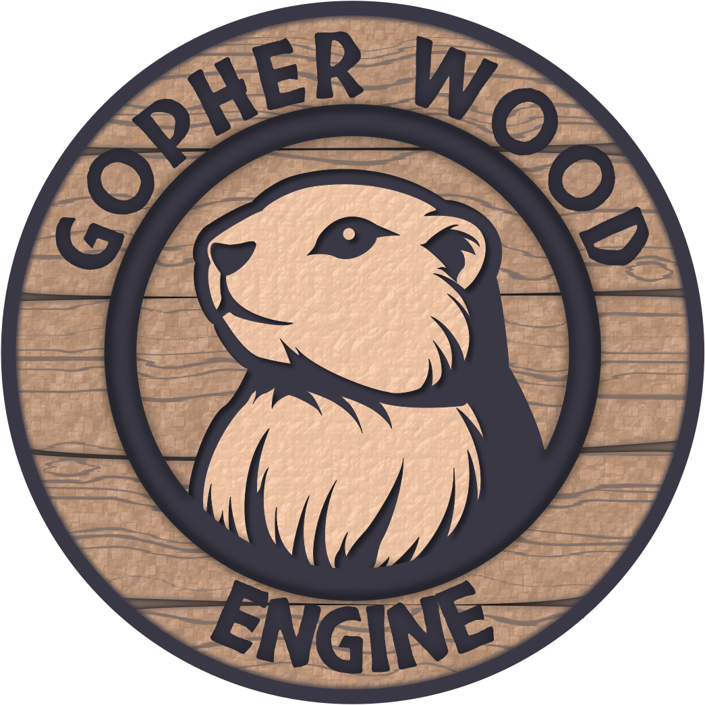

  

# Gopher Wood Engine
Runneth Over Studio's in-house game engine. Written in C#.

In general, development is following [Game Engine Architecture](https://www.taylorfrancis.com/books/mono/10.1201/9781315267845/game-engine-architecture-third-edition-jason-gregory) by Jason Gregory and the [Vulkan Game Engine Series](https://www.youtube.com/watch?v=dHPuU-DJoBM&list=PLv8Ddw9K0JPg1BEO-RS-0MYs423cvLVtj) by Travis Vroman. However, this is still a fairly bespoke solution. If you're interested in open source C# game engines/frameworks, I'd encourage you to check out the proven [Stride](https://github.com/stride3d/stride), [FlatRedBall](https://github.com/vchelaru/FlatRedBall), and [MonoGame](https://github.com/MonoGame/MonoGame).

> [!WARNING]
> This is an in-development, pre-alpha, engine and subject to significant change.
