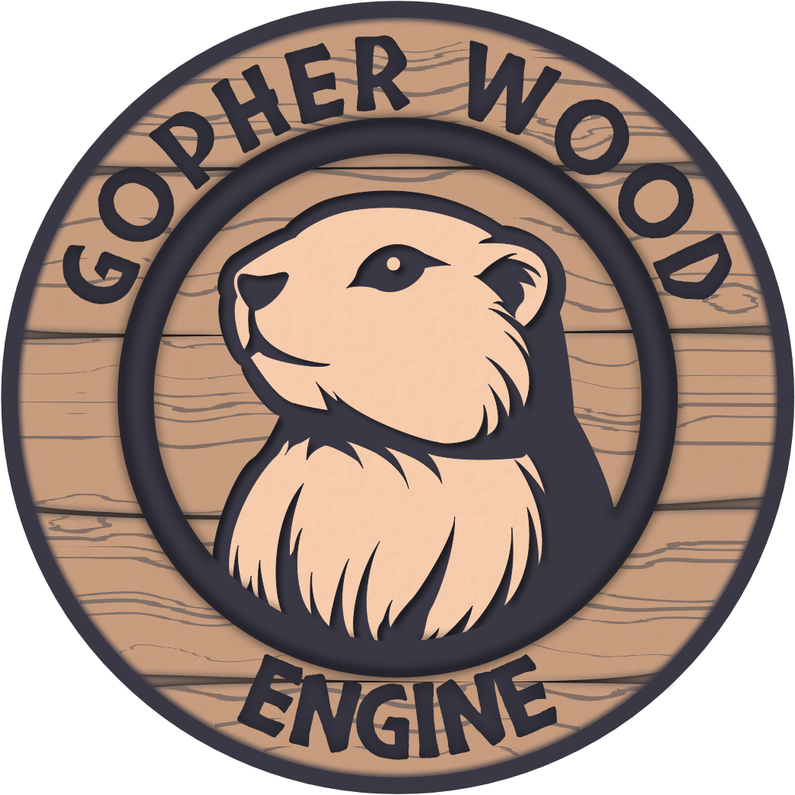

<p align="left">
  
</p>

# Gopher Wood Engine
Runneth Over Studio's in-house game engine. Written in C#.

Development generally follows [Game Engine Architecture](https://www.gameenginebook.com/) by Jason Gregory and the [Vulkan Game Engine Series](https://kohiengine.com/) by Travis Vroman. However, this remains a bespoke solution. For established open-source C# game engines/frameworks, consider exploring [Stride](https://github.com/stride3d/stride), [FlatRedBall](https://github.com/vchelaru/FlatRedBall), and [MonoGame](https://github.com/MonoGame/MonoGame).

> [!WARNING]
> This engine is in pre-alpha development and subject to significant change.

## Versioning
Gopher Wood Engine uses [Semantic Versioning](https://semver.org/).

- **MAJOR** version: Incompatible API changes
- **MINOR** version: Backward-compatible functionality
- **PATCH** version: Backward-compatible bug fixes

During initial development the version will be at 0.1.0. Once a usable API is released, the version will remain 0.y.z during rapid development. When the engine is ready for production use (building a real game), version 1.0.0 will be released.

## Build Requirements
- All projects target the LTS version of the [.NET SDK](https://dotnet.microsoft.com/en-us/download), which also provides the `dotnet` command-line tool used in the build process.
- The engine renderer requires the [Vulkan SDK](https://www.lunarg.com/vulkan-sdk/), which provides validation layers and command-line tools for shader compilation. 
	- The 'VULKAN_SDK' environment variable expected to be set during installation and is required by the build.
- The Build project must be run at least once prior to launching other projects to ensure necessary shaders are compiled and embedded into the engine runtime.
	- The Build project uses [Cake](https://cakebuild.net/) (C# Make) as the build orchestrator and can be launched from your IDE or via script.

		- On OSX/Linux run:
		```bash
		build.sh
		```

		- On Windows PowerShell run:
		```powershell
		./build.ps1
		```

<!-- ## Getting Started -->
<!-- ## Usage -->
<!-- ## Project Structure -->
<!-- ## Acknowledgments -->
